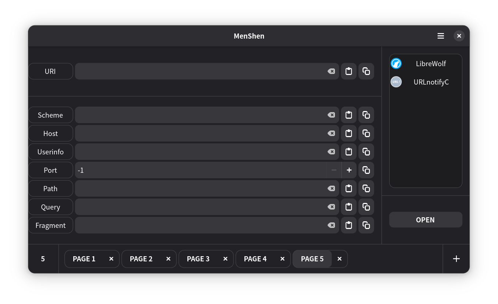

# 门神（MenShen）
由用户来决定如何打开每一个 URL 链接。  

门神（MenShen）是一个 URL 拦截处理工具，基于 GTK4 和 Adwaita，使用 C 语言开发。 

## 须知
**本项目目前仍处于极早期开发阶段，只有测试版本。可能存在恶性 Bug，请谨慎使用，避免不必要的损失。**
- 本项目为本人第一次独立维护项目，经验及代码能力都有不足，所以该软件可能存在未发现的恶性 Bug。
- 本项目目前只有 Linux 版本，Windows 版本在计划中，但由于本人开发环境完全基于 Linux，无法确定是否可行。
- 本项目大部分三方库 Api 原型及示例由 LLM 提供，虽然计划会在之后集中审查，但目前本人无法保证这些 Api 的使用是否安全可靠。

## 截图

## 特性
- 拦截所有将要打开的 URL 链接并弹窗（需要设置为默认浏览器）
- 自动解析 URL 为不同部分，更加灵活地编辑清理
- 支持选择 URL 打开方式，例如不同的浏览器
- 支持多标签页，可同时解析多个 URL
- 完全离线，无任何联网功能

## 使用
### 安装
Linux 用户可从 [GitHub Release](https://github.com/AsimovGod/menshen/releases) 或 [Codeberg Release](https://codeberg.org/AsimovGod/menshen/releases) 下载对应的软件包安装使用：
- Debian及其衍生发行版： 
可使用 `apt` 等包管理工具安装 .deb 文件。
- 其他发行版：
下载 `.tar.gz` 文件后手动解压并将文件复制至对应目录。

### 运行
- 在安装软件后将本软件设置为默认浏览器，即可拦截所有 URL 打开操作。
- 也可以直接在命令行中运行，例如 `menshen http://example.com`。

## 源码
- [GitHub](https://github.com/AsimovGod/menshen)
- [Codeberg](https://codeberg.org/AsimovGod/menshen)

## 致谢
- [GTK](https://gitlab.gnome.org/GNOME/gtk)
：本项目基于 GTK 开发。

- [Adwaita](https://gitlab.gnome.org/GNOME/libadwaita)
：本项目界面样式基于 Adwaita。

- [URLCheck](https://github.com/TrianguloY/URLCheck)
：本项目的灵感来源。

- [GTK 4 Tutorial for beginners](https://github.com/ToshioCP/Gtk4-tutorial)
：本项目起步阶段参考的文档。

## 图标
本项目图标采用 [CC-BY-4.0](resource/icon/LICENSE) 协议分发：
- `resource/icon/menshen.kra`
- `resource/icon/menshen.png`

本项目图标基于以下项目修改而来：
- [Fluent UI Web](https://github.com/microsoft/fluentui)
： `resource/icon/origin/door_fluentui.svg`

- [Noto Emoji](https://github.com/googlefonts/noto-emoji)
： `resource/icon/origin/lotus_noto-emoji.svg`

- [FxEmojis](https://github.com/mozilla/fxemoji)
：`resource/icon/origin/light_fxemoji.svg`

## 许可
本项目所有源码均采用 [GPL-3.0-or-later](LICENSE) 协议开源。
